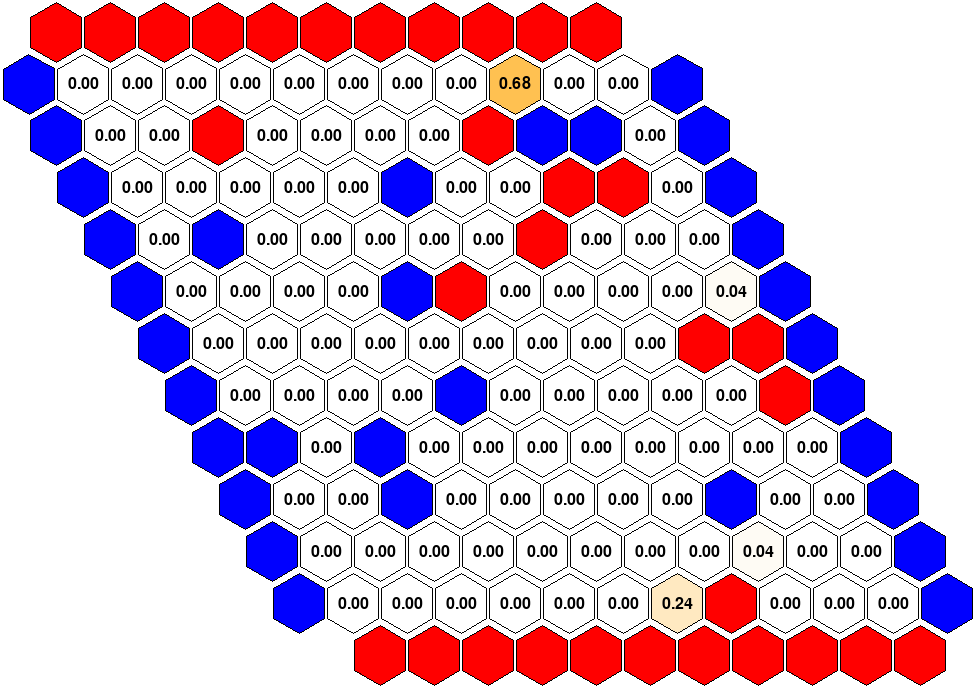
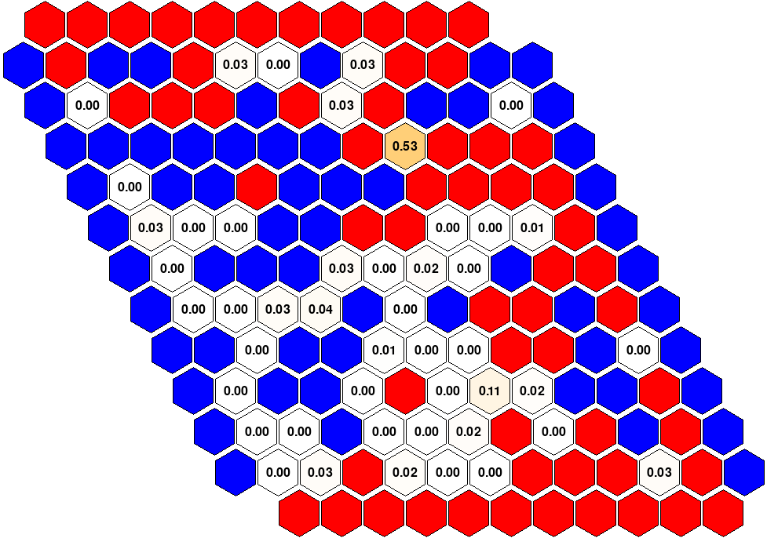

# AlphaZero implementation for the game of Hex

  
  

## Configuration Parameters

| Training | `searches` | `iterations` | `selfPlay_iterations` | `parallel_games` | `batch_size` | C   | `temperature` | `dirichlet_epsilon` | `dirichlet_alpha` |
|----------|------------|---------------|-----------------------|------------------|--------------|-----|---------------|---------------------|-------------------|
| 1        | 300        | 10            | 2000                  | 200              | 512          | 1.5 | 1.25          | 0.25                | 0.3               |
| 2        | 200        | 10            | 2000                  | 200              | 512          | 1.5 | 1.25          | 0.25                | 0.3               |
| 3        | 100        | 10            | 2000                  | 200              | 512          | 1.5 | 1.25          | 0.25                | 0.3               |
| 4        | 50         | 10            | 2000                  | 200              | 512          | 1.5 | 1.25          | 0.25                | 0.3               |
| 5        | 25         | 10            | 2000                  | 200              | 512          | 1.5 | 1.25          | 0.25                | 0.3               |
| 6        | 10         | 10            | 2000                  | 200              | 512          | 1.5 | 1.25          | 0.25                | 0.3               |
| 7        | 100        | 10            | 2000                  | 200              | 512          | 0.1 | 1.25          | 0.25                | 0.3               |

This table details the configuration parameters used in the training scenarios.
